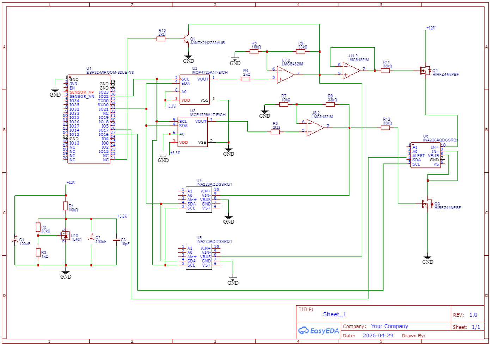

# 🔬 Trazador de Curvas MOSFET Automatizado

Sistema de caracterización de MOSFETs basado en ESP32, diseñado para obtener curvas ID-VDS con alta precisión mediante técnica de micro-pulsos que elimina efectos térmicos.

---

## 🚀 Características principales

- ⚡ Micro-pulsos de 150 µs para evitar deriva térmica
- 📊 Medición de alta resolución (sensor INA228 de 20 bits)
- 🎛️ Control analógico mediante DACs (MCP4725)
- 🔁 Lazo cerrado para ajuste preciso de voltajes
- 🧠 Extracción automática de parámetros:
  - Voltaje de umbral (Vth)
  - Transconductancia (gm)
- 🖥️ Interfaz gráfica en Python (CustomTkinter + Matplotlib)
- 📁 Exportación de datos para análisis y simulación SPICE

---

## 🖼️ Vista general del proyecto

El sistema integra hardware de adquisición, firmware embebido en ESP32 y una interfaz gráfica en Python para realizar caracterización automatizada de MOSFETs de potencia.

---

## 🔧 Prototipo físico

El prototipo está montado sobre una base compacta e integra la etapa de potencia, disipación térmica, terminales de conexión para el DUT y comunicación hacia la computadora.

---

## 🧩 Esquemático del hardware

El diseño incluye una unidad de control ESP32, DACs MCP4725, sensores INA228, etapas analógicas con amplificadores LMC6482 y una etapa de potencia para la caracterización del dispositivo bajo prueba.

---

## 🖥️ Interfaz gráfica

La interfaz permite seleccionar el puerto COM, iniciar el barrido de familia, visualizar las curvas ID-VDS, extraer parámetros eléctricos y exportar los datos generados.

---

## 📊 Resultados obtenidos

El sistema genera familias de curvas ID-VDS para distintos valores de VGS, permitiendo analizar las regiones de operación del MOSFET y extraer parámetros como Vth y gm.

---

## 📚 Documentación adicional

- [Guía de uso](assets/docs/Guia_de_uso.pdf)
- [Comparativa de trazadores de curvas](assets/docs/Comparativa_Trazadores.pdf)

El reporte comparativo indica que el prototipo tiene un costo aproximado de 100 USD y destaca su ventaja frente a equipos comerciales por su relación potencia/costo y capacidad de medición pulsada. También menciona exportación directa a CSV, modelado compacto y seguridad dinámica ante sobrecorriente. :contentReference[oaicite:0]{index=0}

## 🧩 Arquitectura del sistema

ESP32 (Firmware)
│
├── Control de DACs (VGS, VDS)
├── Generación de micro-pulsos
├── Lectura de corriente/voltaje (INA228)
│
▼
Comunicación Serial (UART)
▼
Python GUI
├── Visualización en tiempo real
├── Procesamiento de datos (NumPy, Pandas)
├── Extracción de parámetros
└── Exportación a CSV

---

## 📁 Estructura del proyecto

Trazador-de-Curvas-MOSFET-Automatizado/
│
├── firmware/
│ └── arduino.ino # Código ESP32 (adquisición de datos)
│
├── software/
│ └── tracer_gui.py # Interfaz en Python
│
├── requirements.txt # Dependencias de Python
└── README.md

---

## ⚙️ Requisitos

### 🔧 Hardware
- ESP32 (WROOM-32)
- Sensor INA228
- DAC MCP4725 (x2)
- MOSFET bajo prueba (ej. IRFZ44N)
- Fuente de alimentación
- Resistencia shunt de precisión

---

### 💻 Software

Instalar dependencias:
pip install -r requirements.txt

▶️ Uso
1.- Conectar el ESP32 y cargar el firmware (arduino.ino)
2.- Abrir el script de Python:
python tracer_gui.py

3.- Configurar el puerto COM
4.- Iniciar barrido desde la interfaz
5.- Visualizar curvas ID-VDS en tiempo real

## 🔧 Hardware Design

📊 Resultados
El sistema genera:
--Curvas ID vs VDS para diferentes VGS
--Parámetros eléctricos automáticamente:
--Vth (voltaje de umbral)
--gm (transconductancia)

Además permite:
--Exportar datos en formato CSV
--Generar reportes para simulación SPICE

🎯Aplicaciones
--Caracterización de dispositivos de potencia
--Validación de modelos SPICE
--Laboratorios de electrónica y semiconductores
--Investigación en dispositivos MOSFET

🧠 Tecnologías utilizadas
- ESP32 (C++)
- Python 3
- NumPy / Pandas
- Matplotlib
- CustomTkinter

📌 Autores
* Francisco Jesús Domínguez Sosa
* Iván Castillo Bravo
* María Alejandra Pérez Santibañez
  
"Instituto Nacional de Astrofísica, Óptica y Electrónica (INAOE)"

📜 Licencia

Este proyecto es de uso académico y de investigación.
